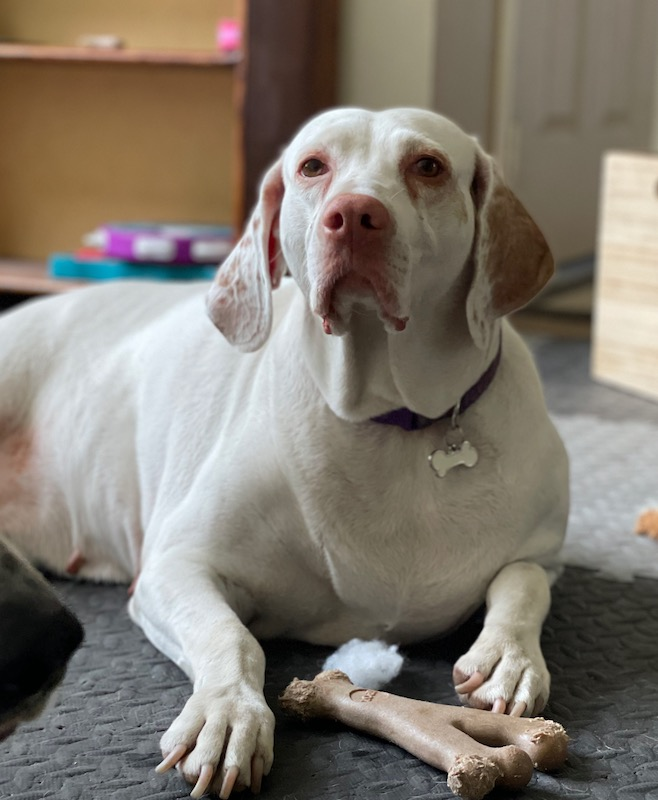

## What did I just do?
Today was my first day really on my own as a new company. The transition from employed elsewhere to here happened so fast. But I’ve survived day one. Let me tell you about it.

I really didn’t sleep much the previous night, and I woke up with rambling thoughts in my head. I really hoped I hadn’t made any sort of mistake. I was feeling quite worried. However, I got dressed and began the day. 

Before starting the morning routine, I laid down on the freshly made bed. My third dog (I have three dogs and one foster), the quietest, gentlest, and most sensitive one, hopped up on the bed and came near me. As I closed my eyes and pondered life’s biggest choices and possible mistakes, I felt a touch on my chest. She had settled next to me and laid her face on me. I think she knew I needed that. She was correct.

After that brief meditation, I got up and walked the other two dogs in the cold Florida morning. The walk too was mind-clearing and uplifting. 

While listening to a podcast and dealing with dogs sniffing, I heard a commercial for [BetterHelp](https://www.betterhelp.com/). The commercial mentioned “life changes”. While walking the last stretch with the pups, I had the sudden desire to sign up. I might just give it a try. Talk with someone. We’ll see.

Work time began. I started with some trepidation: what would today hold? Would I stay busy? I didn’t know the answer to either question but dove in anyway.

A trick I from [*Indistractable: How to Control Your Attention and Choose Your Life*](https://www.amazon.com/Indistractable-Control-Your-Attention-Choose-ebook/dp/B07PG2W6DC/ref=sr_1_1?keywords=Indistractable%3A+How+to+Control+Your+Attention+and+Choose+Your+Life&qid=1638324796&qsid=132-3274193-5502844&s=digital-text&sr=1-1&sres=B07PG2W6DC%2CB086LBHSRT%2CB01KU04K5A%2CB087CCV81L%2CB08W4TMLV7%2CB08SW8FQRR%2CB095V9Q82N%2CB097QLD84J%2CB08LCFVCW7%2CB097N4WJQJ&srpt=ABIS_BOOK) was to put things on the calendar. I wasn't making a to-do list, but a “do-this-then” list. So I scheduled things like [“Update LinkedIn Business Page”](https://www.linkedin.com/company/integrating-magic/?viewAsMember=true) (updates coming very soon), and [“Post to LinkedIn”](https://www.linkedin.com/in/jeremy-brown-jlbmagic/). I had a meeting with a sales guy at [circle.so](https://circle.so/) to see if I could build a community there. Filing up the calendar, and doing the tasks at the appointed time–even if those tasks weren’t finished at the end–gave me purpose and kept my mind busy and warded off other thoughts. 

The day passed quickly. I met with people with whom I’ll be working in a contractor role with a Claris partner. I also got to produce my first sales pitch of widget-building to a client. And I had a few other meetings throughout the day–welcome meetings that encouraged me on this path.

I have to admit that, during the workday, I’d peer over at the LinkedIn Post (see below) and see how many people responded and/or commented. That was heartening.

Anyway, at the end of the day, I actually had a lot of questions and things I didn’t know. But, and this is a [big one](https://www.youtube.com/watch?v=0yfJQUoxN3U), I have a direction and a way forward with all of them. Yes, I need to fully understand how LLCs work and how I pay myself and insurance and contracts work. Yep. I have a lot to learn. And I made plans for the remainder of the week to explore some of these. 

A lot of questions, for sure, but a plan to solve them, energy to overcome them. I’m really looking forward to executing that plan and expanding that energy. 

I finished my day feeling exhilarated and excited. I’m so energized to make the vision I have for Integrating Magic come true that I can’t wait to start tomorrow. The self-doubts, I assume, will pop up here and there. But I’ll simply turn to the next thing to learn/type/fill out and get energy out of those.

Tomorrow is day two. I’ll let you know how it goes. I imagine some of it will be spent at Disney World. Come back here to this blog to see what I ended up doing. 

Magically Yours,

JB

PS. Here's the post I wrote:
<iframe src="https://www.linkedin.com/embed/feed/update/urn:li:share:6871465240865988608" height="798" width="504" frameborder="0" allowfullscreen="" title="Embedded post"></iframe>

