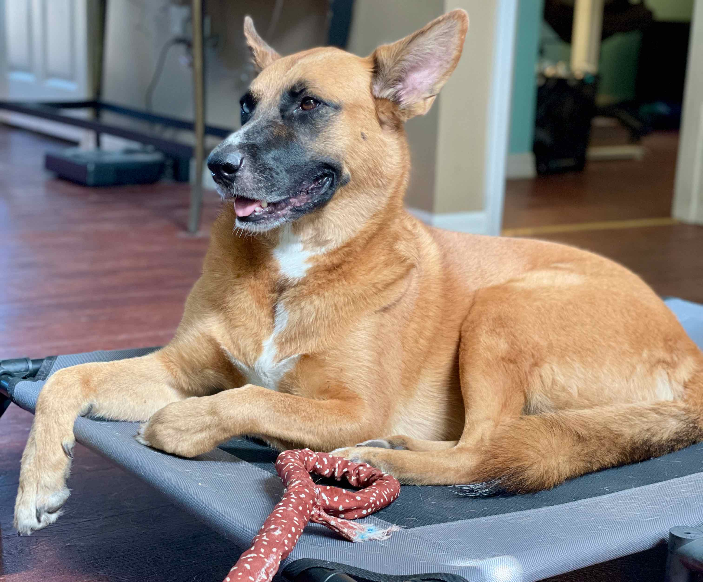

## What a difference a day makes

On day one, I woke up nervous with a huge pit in my gut. With the comfort of Honey (my dog), I was able to start the day and found success in the tasks of figuring out what I don’t know. 

The beginning of day two couldn’t have been more different. My wake-up followed a restful night's sleep (the first in awhile), and my brain filled with the promise of the new day. Yes I know that’s a cliche but it really was true for me!

That’s not to say the day’s thoughts were all positive and forward-thinking. I drifted back into the ‘what did I do?” category of thoughts, but those were held mostly at bay by the chaos of the 2nd day.

First, dog number two, Zelda, had to go in for dental cleaning. She had to be under anesthesia, which meant she couldn’t eat or drink before the 8:00 am drop-off. Telling a dog she can’t eat is near impossible, so my husband and I did all we could to distract her from plopping herself in the kitchen. The hustle and bustle of feeding three dogs but not the fourth was like one of those keystone cop silent films. 

Once I dropped her off at the vet, I began the day. Sticking with a pattern, I continued to fill my calendar with things to do during the day. On today’s schedule was “LinkedIn Company Page”, “Datatables widget practice”, “JS in FM Training outline”, “email list set up”. I got to maybe 2 of those today. 

The time was well spent, however, when I did get to focus on the work. I learned a lot about services that provide email listserv services. I also researched banks good for small businesses. I think I have settled on Novo, for now anyway.

I realized midway through the day that a day not spent in FileMaker or JS was a day I wasn’t bringing in income. That thought bothered me a bit. After considering it a bit, I settled on the idea that I need a business and all the appropriate pieces in place to be able to focus on FileMaker and JS. So I kept picking away at my list.

I did get to talk with a few potential clients. I hope those workout and I can build an API for one and a JS widget for another. 

I don’t yet have a way to keep track of the tasks I do. I’m considering ClickUp to use myself to manage tasks and due dates. It worked very well at my previous job, so I think I'll continue. I don't have to learn something new or build something.

One success of the day: I did set up an email listServe. I’d invite you to [sign up](https://signup.integratingmagic.io/) and support my confidence in knowing these things I explore will work.

At the close of today, I am feeling good. I’ve got a strong sense of what to do next and how to get there. And I can’t wait to pick up the next day. The frustrations and roadblocks of the day were all overcome in one of two ways: I either solved it or I know the path to take to solve it.

Magically yours,
Jeremy