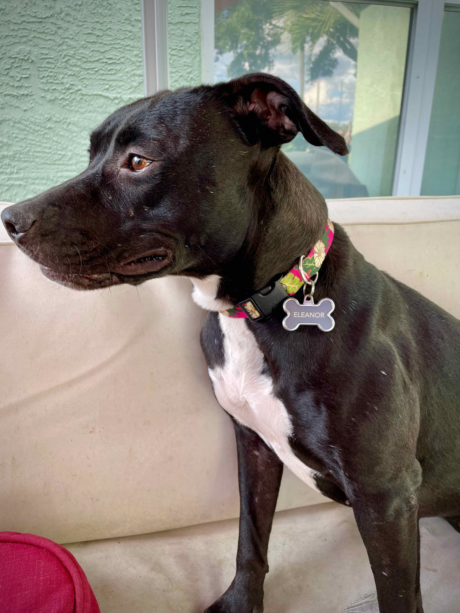

## In the thick of it

There’s quite a forward momentum now in what I’m doing. I see a purpose and a plan; my vision gives weight to everything I’m doing. Though I have to spend lots of time working through the details of having a business, I am not disheartened. Everything I do is in service of how I see myself with this business.

The third day of [Integrating Magic LLC](https://www.integratingmagic.io) was a day of those business things mostly. During the work hours (and beyond), I met with an accountant, researched health insurance, and explored website builders. I met with two clients of my own and a Claris Partner with whom I’ll be doing some work. It was a busy day; it was a meaningful day, and I’m learning a lot.

The day started as it always does: dog care. My spouse and I take turns with the morning dog-walking shift. That morning I got to stay home with Honey (you’ve met her in a previous post) and the foster dog, Eleanor.

 While he was out walking Kirby and Zelda, I played with the other two, cuddled with them some, and tried to get some cleaning done around the house. Eleanor is pretty obsessed with me at the moment, so she’s always underfoot. 

After everyone returned home and dog tooth brushing treats were dispensed, I gathered up my Kindle and notebook. I ventured to my favorite place for morning contemplation: the local diner.

French toast, bacon, grits (I am in the south, after all), and a Coke Zero eventually arrived at my table. While waiting, with AirPods in my ear playing quiet Christmas music, I wrote down notes and questions for my next appointment: the accountant. I had a lot of questions for them and tried to get them on paper in some coherent order. The truth was, I had almost no idea about this part of a business. 

I may not have known a whole lot going in, but when I left the accountant’s office, I had a clearer picture of what she could do for me and how this all works. The conversation was eye-opening; I learned what the IRS considers a “reasonable salary” for LLCs and how to supplement the salary with any profits left over. The topic is fascinating. 

The other business-creation things included researching health insurance and website builders–two very different things. One was overwhelming, and one tapped into what I already know how to do. I’ll let you guess which one was overwhelming (even when it shouldn’t be!)

I need a website. Yes, people know me, and I can market my services in person; but I can’t be everywhere (I try, I really do), so my website needs to be a decent proxy. After considering ‘low code’ website builders, I chose Next JS and Vercel to be my project. There’s more overhead in building something–I have to write the code–but all that I’ve learned up to this point has led me to this. I can make a website. 

Day three was fun and exciting; I wonder how long this honeymoon will last? I’ve got work coming in and (eventually) the money from that work. 

Magically yours,

Jeremy